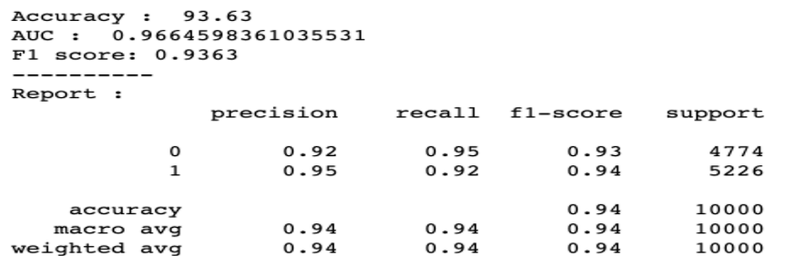
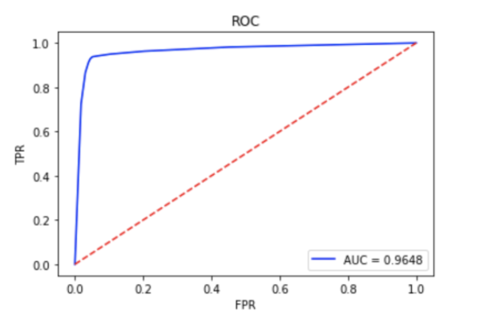

# Pok-mon-Combat-Prediction
DS502_Final_Project. 

**1.Data Overview**

This Pokémon combat dataset is public and shared on Kaggle: https://www.kaggle.com/terminus7/Pokémon-challenge.

***1.1Distribution Overview***

***1.2 Characteristics***

**2.Feature Engineering**

***2.1Design Training Entries***

***2.2Design the Equation***

**3.Models**
***Logistic Regression***

***Naive Bayes***

***Support Vector Machine***

***Decision Tree***

***KNN***

***Random Forest***

**4.Summary**

***4.1Results Summary***

***4.2Results Analysis***

a. The dataset contains both discrete data and continuous data. Tree-typed algorithms are particularly good at processing such mixed formats. (Random Forest, AdaBoost, and Decision Tree are all tree-like algorithms)

b. The random forest based on Bagging and AdaBoost based on the Boosting method can well realize parallelization in the training process. They have the power to handle a large data set with higher dimensionality.

c. Random Forest is easier to implement than AdaBoost because AdaBoost needs to do more work on feature engineering to get good performance. AdaBoost may work better when the data is clean, while Random Forest is more applicable when the data complex.

